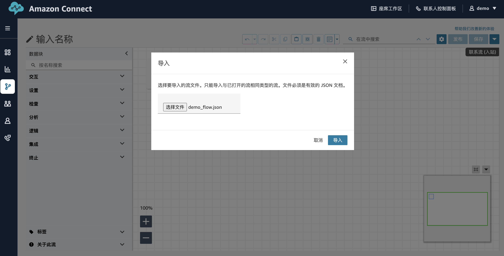
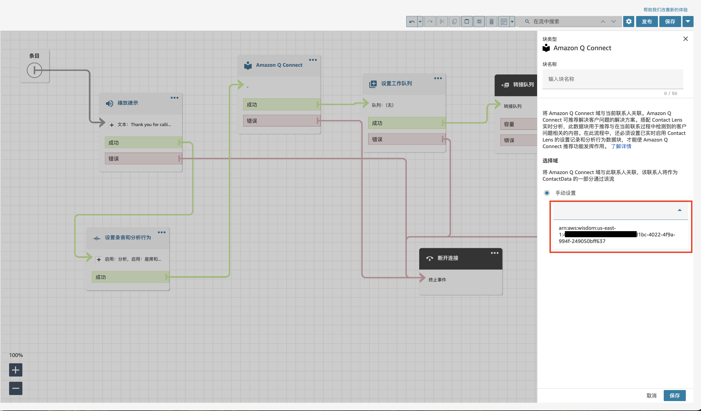

# 全托管模式部署文档

利用Amazon Connect，Amazon Q和Amazon Contact Lens实现全托管的智能联络中心服务。

Amazon Q in Connect是一个生成式AI客户服务助手，基于LLM能够提供实时建议，帮助联络中心的客服代表快速、准确地解决客户问题。通过对话分析和自然语言理解(NLU)自动检测通话和聊天中的客户意图。随后，它为客服代表提供即时的生成式响应和建议的操作，还会提供相关文档和文章的链接。除了自动接收推荐外，客服代表还可以直接使用自然语言或关键词查询 Amazon Q in Connect 以解答客户需求。Amazon Q in Connect无缝集成在Amazon Connect的客服代表工作空间内。

Amazon Connect Contact Lens提供联络中心分析和质量管理功能，使您能够监控、衡量并持续改进联络质量和客服代表的表现，从而提升整体客户体验。

## Architecture


## Step1: 创建实例(~5分钟)

- 建议在创建实例时选择创建管理员账户

请参考文档<a href="https://docs.aws.amazon.com/connect/latest/adminguide/amazon-connect-instances.html"> Connect实例 </a>创建一个Amazon Connect实例


## Step2: 创建Connect域(~5分钟)

1. 打开Amazon Connect控制台 https://console.aws.amazon.com/connect/。

2. 在“实例”页面, 点击上一步创建的实例别名。


3. 在导航窗格中，选择Amazon Q，然后选择“Add domain”。

4. 在“Add domain”页面上，选择“Create a new domain”。

5. 在“Domain name”框中，输入一个便于识别的名称，例如您的组织名称。


6. 点击“创建AWS KMS 密钥”,这将导航到KMS控制台。


- 密钥配置选项

点击下一步

- 添加别名，可选的描述及标签

点击下一步

- 定义密钥管理权限
保持默认选项，点击下一步

- 定义密钥使用权限
保持默认选项，点击下一步

- 审核
在密钥策略部分，追加如下Statement
```
{
    "Effect": "Allow",
    "Principal": {
        "Service": "connect.amazonaws.com"
    },
    "Action": [
        "kms:Decrypt",
        "kms:GenerateDataKey*",
        "kms:DescribeKey"
    ],
    "Resource": "*"
}
```

修改完毕后，policy类似如下：
```
{
    "Id": "key-consolepolicy-3",
    "Version": "2012-10-17",
    "Statement": [
        {
            "Effect": "Allow",
            "Principal": {
                "AWS": "arn:aws:iam::your_accountId:root"
            },
            "Action": "kms:*",
            "Resource": "*"
        },
        {
            "Effect": "Allow",
            "Principal": {
                "Service": "connect.amazonaws.com"
            },
            "Action": [
                "kms:Decrypt",
                "kms:GenerateDataKey*",
                "kms:DescribeKey"
            ],
            "Resource": "*"
        }
    ]
}   
```

点击完成，密钥创建完毕。


7. 返回到 Amazon Q in Connect浏览器标签页，打开 AWS KMS密钥列表，选择您在之前步骤中创建的密钥, 点击“Add domain”


## Step3: 创建知识库

1. 上传内部知识文档到S3，目前受支持的文档格式如下：
- 纯文本文件必须为 UTF-8 格式。
- Word 文档必须为 DOCX 格式。Word 文档将自动转换为简化的 HTML，无法保留源文档的字体、字号、颜色、高亮、对齐方式或其他格式（例如背景颜色、页眉或页脚）。
- PDF文件，不能加密或设置密码保护，并且PDF文件中嵌入的操作和脚本不受支持。

2. 可以从docs/fully_managed/resource/下，下载两个实例知识文件，并上传到S3桶，推荐使用一个新的S3桶来专门存放知识文件。


3. 打开Amazon Q页面，点击“Add integration”


4. 添加Integration 
- 在“Add integration”页，选择“Create a new integarion”, Source选择“S3”， 并为integratio输入合适的名称


- S3 URI，选在刚才创建的S3桶， AWS KMS key选择上一步中创建的密钥，点击下一步。


5. 确认选择，并点击“Add integraion”按钮，完成知识库创建。

## Step4: 创建Amazon connect flow

1. 在“实例”页， 点击“访问URL”，用管理员账户登录Amazon connect实例
- 如果在创建实例时没有创建管理员用户，请使用紧急登录的方式，登录到实例并创建一个管理员用户

2. 点击“路由选择”， 选择“流”


3. 点击“创建流”， 点击右上角向下的箭头，选择“导入”


4. 选择/fully_managed/resource/demo_flow.json, 导入制作好的流定义文件
, 点击导入

5. demo流


6. 更改Amazon Q connect块
选中“Amazon Q Connect”块，点击“...”, 选择编辑设置


7. 设定域
从手动下拉菜单中选择创建的域

点击“保存”按钮

8. 更改队列
选择“设置工作队列”块，点击“...”, 选择编辑设置，选择“BasicQueue”

点击“保存”按钮

9. 点击右上角“保存”按钮，保存流的修改，然后点击“发布”按钮，将流发布


## Step5: 创建测试用户

1. 利用管理员账户登录到实例，选择用户 -> 用户管理


2. 创建测试用户，注意安全配置文件选择如下图所示的配置，方便测试


点击“保存”按钮

3.  利用管理员账户登录到实例，选择用户 -> 安全配置文件


4. 点击“Agent”， 找到“座席应用程序”， 点击下拉箭头， 勾选Amazon Q Connect


5. 找到“数字和流”， 点击下拉箭头， 勾选“聊天测试模式 - 全部”

点击“保存”按钮

6. 找到“客户配置文件”， 点击下拉箭头， 勾选“客户档案 - 查看”和“计算的属性 - 查看”

点击“保存”按钮


## Step6: 添加电话号码

1. 打开conenct实例首页，在“探索您的通信通道”区域找到 “开始”按钮，并点击


2. 如下图所示添加一个电话号码，可能需要切换电话号码来选择一个可用的，点击下一步


3. 点击 “暂时跳过”，忽略测试步骤

4. 点击刚申请好的电话号码， 在“联系流/IVR”中选择上面步骤创建的流, 保存修改


## Step7: 测试Connect Q

1. 退出Admin用户，改用创建的agent用户登录Conenct实例

2. 打开conenct实例首页，在“探索您的通信通道”区域找到 “测试聊天”，并点击


3. 点击“测试设置”， 从联系流下拉菜单中选择，前序步骤创建的流， 点击应用


4. 点击右上角“坐席工作区”，这将打开新的浏览页面， 随后在工作区更改状态改为“Available”，等待电话接入

5. 在原来的“测试聊天”页面，点击右下角的聊天图表，开始模拟客户电话


6. 在作息工作区收到呼入电话，接收聊天


7. 在测试窗口中，输入“How to reset my password？”，并发送

8. 在坐席工作区，Amazon Q自动给出了建议提醒


9. 坐席可以点击给出的建议，获取答案


10. 可以尝试在Amazon Q窗口中，直接输入问题，获取答案


### 样例问题

- How can I change my registered phone number?
- How do I log in with a new phone number?
- What information is needed to link a bank card?
- How can I view my activity records?
- What should I do if facial recognition fails after cosmetic surgery?
- What should I do if I forget my login password, and how can I reset it?
- How can I update my personal information?


## Step8: Connect lens提供的功能

### 仪表板和报表

请参考文档<a href="https://docs.aws.amazon.com/connect/latest/adminguide/analyze-conversations.html">仪表板</a>


### 绩效评估

请参考文档<a href="https://docs.aws.amazon.com/connect/latest/adminguide/evaluations.html">绩效评估</a>


### 监控实时对话和记录的对话

请参考文档<a href="https://docs.aws.amazon.com/connect/latest/adminguide/monitoring-amazon-connect.html">监控对话</a>
