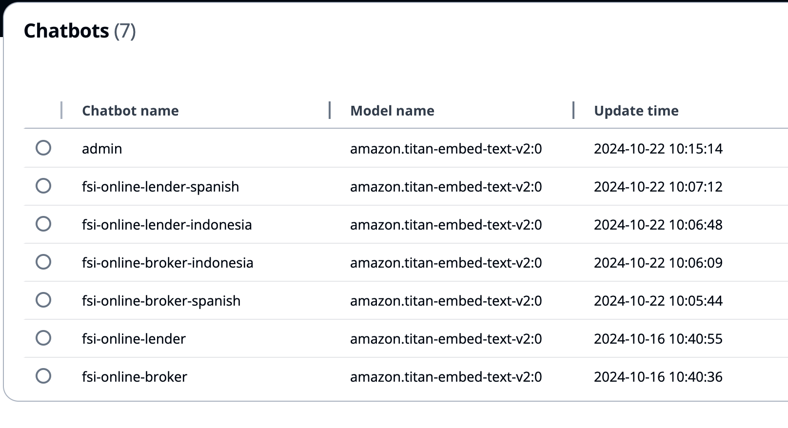
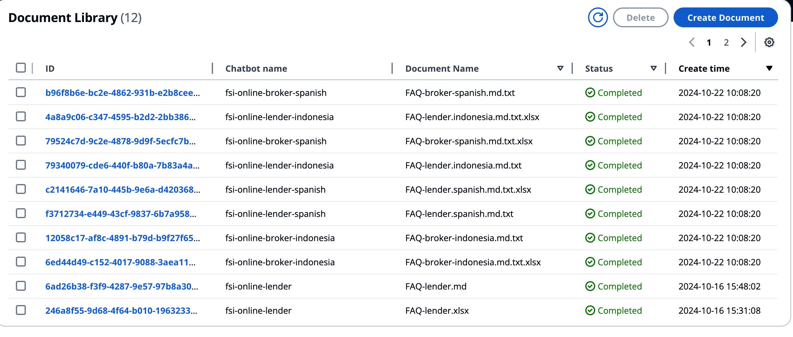
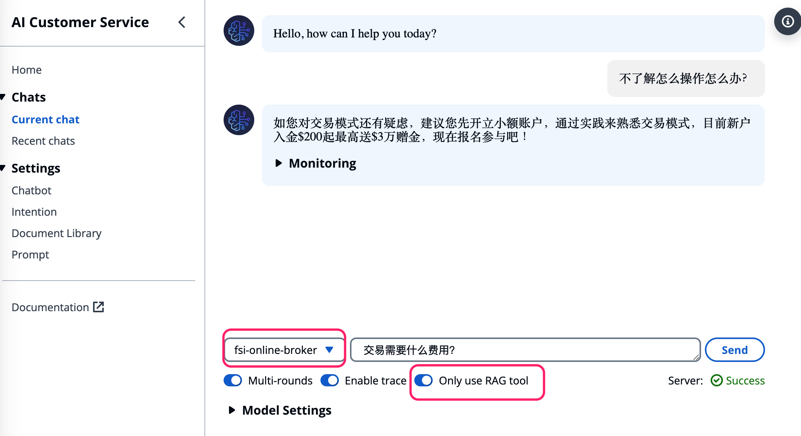

# Clould Call Center For FSI - Customer Service Chatbot Deployment Guide

## 1. Install AI Customer Service

Follow the instructions in [AI Customer Service Deployment Guide](https://gitlab.aws.dev/aws-gcr-solutions/industry-assets/fsi/cloud-call-center-for-fsi#quick-start) to install Intelli Agent.

## 2. Create Chatbots

### Create FSI Broker Chatbot for Chinese

1. Go to the [Chatbot Management Console](https://ccc.fsi.industry.gcr.aws.dev/chatbot-management)

2. Click **Create Chatbot**

3. Fill in the chatbot name: **fsi-online-broker-chinese**

4. Click **Create**


### Create Document for FSI Broker Chatbot for Chinese

#### Create qd index

1. Go to the [Document Library Console](https://ccc.fsi.industry.gcr.aws.dev/library)

2. Click **Create Document**

3. Select File: [FAQ-broker-chinese.md.txt](https://gitlab.aws.dev/aws-gcr-solutions/industry-assets/fsi/cloud-call-center-for-fsi/-/blob/main/data/FAQ-broker-chinese.md.txt?ref_type=heads)

4. Select Chatbot name: **fsi-online-broker-chinese**

5. Select Index Type: **qd**

6. Click **Upload**


#### Create qq index

1. Go to the [Document Library Console](https://ccc.fsi.industry.gcr.aws.dev/library)

2. Click **Create Document**

3. Select File: [FAQ-broker-chinese.xlsx](https://gitlab.aws.dev/aws-gcr-solutions/industry-assets/fsi/cloud-call-center-for-fsi/-/blob/main/data/FAQ-broker-chinese.xlsx?ref_type=heads)

4. Select Chatbot name: **fsi-online-broker-chinese**

5. Select Index Type: **qq**

6. Click **Upload**


### Create FSI Chatbots for Spanish and Indonesia

Follow similar steps as creating FSI Broker Chatbot for Chinese to create FSI Chatbots for Spanish and Indonesia.

When finished, you will see the following similar screen:




Follow similar steps as creating Document for FSI Broker Chatbot for Chinese to create Document for FSI Chatbots for Spanish and Indonesia.


|Chatbot Name| Chatbot Type| Language| Document Name| Index Type|
|---|---|---|---|---|
|fsi-online-broker-chinese|Broker|Chinese|[FAQ-broker-chinese.md.txt](https://gitlab.aws.dev/aws-gcr-solutions/industry-assets/fsi/cloud-call-center-for-fsi/-/blob/main/data/FAQ-broker-chinese.md.txt?ref_type=heads)|qd|
|fsi-online-broker-chinese|Broker|Chinese|[FAQ-broker-chinese.xlsx](https://gitlab.aws.dev/aws-gcr-solutions/industry-assets/fsi/cloud-call-center-for-fsi/-/blob/main/data/FAQ-broker-chinese.xlsx?ref_type=heads)|qq|
|fsi-online-broker-indonesia|Broker|Indonesia|[FAQ-broker-indonesias.md.txt](https://gitlab.aws.dev/aws-gcr-solutions/industry-assets/fsi/cloud-call-center-for-fsi/-/blob/main/data/FAQ-broker-indonesias.md.txt?ref_type=heads)|qd|
|fsi-online-broker-indonesia|Broker|Indonesia|[FAQ-broker-indonesia.xlsx](https://gitlab.aws.dev/aws-gcr-solutions/industry-assets/fsi/cloud-call-center-for-fsi/-/blob/main/data/FAQ-broker-indonesia.xlsx?ref_type=heads)|qq|
|fsi-online-broker-spanish|Broker|Spanish|[FAQ-broker-spanish.md.txt](https://gitlab.aws.dev/aws-gcr-solutions/industry-assets/fsi/cloud-call-center-for-fsi/-/blob/main/data/FAQ-broker-spanish.md.txt?ref_type=heads)|qd|
|fis-online-broker-spanish|Broker|Spanish|[FAQ-broker-spanish.xlsx](https://gitlab.aws.dev/aws-gcr-solutions/industry-assets/fsi/cloud-call-center-for-fsi/-/blob/main/data/FAQ-broker-spanish.xlsx?ref_type=heads)|qq|
|fsi-online-lender-chinese|Lender|Chinese|[FAQ-lender-chinese.md.txt](https://gitlab.aws.dev/aws-gcr-solutions/industry-assets/fsi/cloud-call-center-for-fsi/-/blob/main/data/FAQ-lender-chinese.md.txt?ref_type=heads)|qd|
|fsi-online-lender-chinese|Lender|Chinese|[FAQ-lender-chinese.xlsx](https://gitlab.aws.dev/aws-gcr-solutions/industry-assets/fsi/cloud-call-center-for-fsi/-/blob/main/data/FAQ-lender-chinese.xlsx?ref_type=heads)|qq|
|fsi-online-lender-indonesia|Lender|Indonesia|[FAQ-lender-indonesias.md.txt](https://gitlab.aws.dev/aws-gcr-solutions/industry-assets/fsi/cloud-call-center-for-fsi/-/blob/main/data/FAQ-lender-indonesias.md.txt?ref_type=heads)|qd|
|fsi-online-lender-indonesia|Lender|Indonesia|[FAQ-lender-indonesia.xlsx](https://gitlab.aws.dev/aws-gcr-solutions/industry-assets/fsi/cloud-call-center-for-fsi/-/blob/main/data/FAQ-lender-indonesia.xlsx?ref_type=heads)|qq|
|fsi-online-lender-spanish|Lender|Spanish|[FAQ-lender-spanish.md.txt](https://gitlab.aws.dev/aws-gcr-solutions/industry-assets/fsi/cloud-call-center-for-fsi/-/blob/main/data/FAQ-lender-spanish.md.txt?ref_type=heads)|qd|
|fis-online-lender-spanish|Lender|Spanish|[FAQ-lender-spanish.xlsx](https://gitlab.aws.dev/aws-gcr-solutions/industry-assets/fsi/cloud-call-center-for-fsi/-/blob/main/data/FAQ-lender-spanish.xlsx?ref_type=heads)|qq|

When finished, you will see the following similar screen:




## 3. Create Prompts

1. Go to the [Prompt Console](https://ccc.fsi.industry.gcr.aws.dev/prompts)

2. Click **Create Prompt**

3. Select Chatbot Name: **fsi-online-broker-chinese**

4. Click **rag**

Update prompt as below:

```
You are a customer service agent, and answering user's query. You ALWAYS follow these guidelines when writing your response:
<guidelines>
- NERVER say "根据搜索结果/大家好/谢谢/根据这个文档...".
- 回答简单明了
- 如果问题与<docs>里面的内容不相关，请回答 "找不到相关内容"，不需要额外补充内容
- 不要说“根据内部知识库”，直接回答即可
</guidelines>

Here are some documents for you to reference for your query.
<docs>
{context}
</docs>
```
5. Click **Create Prompt**

6. Repeat steps 2-5 to create prompts for other chatbots


## 4. Test Chatbots

1. Go to the [Current Chat Console](https://ccc.fsi.industry.gcr.aws.dev/chats)

2. Select the right Chatbot Name: **fsi-online-broker-chinese**

3. Turn on **Only use RAG tool**

4. Input your question and click **Send**

The screen is as below:



## 5. API of Chatbot

1. Get API endpoint from CloudFront Output. For demo install, the API endpoint is: https://3najpcjqc8.execute-api.us-east-1.amazonaws.com/prod/llm

2. Reffer the LLM [API schema](https://gitlab.aws.dev/aws-gcr-solutions/industry-assets/fsi/cloud-call-center-for-fsi/-/blob/main/docs/LLM_API_SCHEMA.md?ref_type=heads) to build your request

Example of the request:

```sh
curl -H "Content-Type: application/json" -H "Authorization: Bearer TestMe " https://3najpcjqc8.execute-api.us-east-1.amazonaws.com/prod/llm  -d '{
    "query": "不了解怎么操作怎么办？",
    "entry_type": "common",
    "session_id": "b460b65b-1",
    "user_id": "f4988458-8071-70d3-14e5-be458f898fa7",
    "chatbot_config": {
        "group_name": "Admin",
        "chatbot_id": "fsi-online-broker",
        "goods_id": "111111112",
        "chatbot_mode": "agent",
        "google_api_key": "",
        "default_llm_config": {
            "model_id": "anthropic.claude-3-sonnet-20240229-v1:0",
            "endpoint_name": "",
            "model_kwargs": {
                "temperature": 0.01,
                "max_tokens": 1000
            }
        },
        "agent_config": {
            "only_use_rag_tool": true
        }
    }
}'
```
